# Bangla RAG System

This project is a Retrieval-Augmented Generation (RAG) system specifically designed for processing and querying documents in Bengali and English. It uses a sophisticated pipeline to extract text from PDF files, clean and chunk the text, generate embeddings, and use a Large Language Model (LLM) to answer questions based on the document content.


The core logic of the RAG system is organized into several modules in the `rag_code` directory:

-   `extractor.py`: Handles the extraction of text from PDF files. It converts PDF pages to images and then uses Tesseract OCR to extract the text. It also includes extensive text cleaning functions.
-   `chunker.py`: Implements a custom chunking strategy for Bengali and mixed-language text. It splits the text into smaller, semantically meaningful chunks.
-   `embedder.py`: Generates vector embeddings for the text chunks using a pre-trained Hugging Face model.
-   `db.py`: Manages the FAISS vector store, including creating, saving, and loading the vector database.
-   `llm.py`: Contains the main RAG pipeline, including the LLM, conversational memory, and the retrieval chain.
-   `app.py`: The main Streamlit application that provides a user interface for interacting with the RAG system.

### System Diagram

```mermaid
%%{init: {'themeVariables': {'fontSize': '10px'}, 'config': {'nodeSpacing': 5, 'rankSpacing': 10}}}%%
graph TD
    subgraph "Indexing Pipeline 🛠️"
        A[📄 PDF Document] --> B{extractor.py}
        B --> |Cleaned Text| C{chunker.py}
        C --> |Text Chunks| D{embedder.py}
        D --> |Vector Embeddings| E[📊 FAISS Vector Store]
    end

    subgraph "Retrieval & Generation Pipeline ⚡"
        F[❓ User Query] --> G{embedder.py}
        G --> |Query Embedding| H{Retriever}
        E --> H
        H --> |Relevant Chunks| I{llm.py}
        F --> I
        I --> J[✨ Generated Answer]
    end

    %% Styling
    classDef pipeline fill:#f0f8ff,stroke:#4682b4,stroke-width:2px,color:#333,stroke-dasharray:5
    classDef input fill:#e6e6fa,stroke:#9370db,stroke-width:2px,color:#333
    classDef output fill:#98fb98,stroke:#3cb371,stroke-width:2px,color:#333
    classDef process fill:#ffebcd,stroke:#daa520,stroke-width:2px,color:#333,stroke-dasharray:0

    class A,F input
    class E,J output
    class B,C,D,G,H,I process
    class indexing,retrieval pipeline
```


## Setup Guide

1.  **Clone the repository:**
    ```bash
    git clone https://github.com/mohaakash/bangla_rag.git
    cd bangla_rag
    ```

2.  **Create a virtual environment:**
    ```bash
    python -m venv .venv
    source .venv/bin/activate  # On Windows, use `.venv\Scripts\activate`
    ```

3.  **Install the required dependencies:**
    ```bash
    pip install -r requirements.txt
    ```

4.  **Install Tesseract OCR:**
    This project uses Tesseract for Optical Character Recognition. You need to install it on your system and provide the path to the executable in `rag_code/extractor.py`.

    -   **Windows:** Download and install from the official [Tesseract installer](https://github.com/UB-Mannheim/tesseract/wiki). Update the path in `rag_code/extractor.py`:
        ```python
        pytesseract.pytesseract.tesseract_cmd = r'C:/Program Files/Tesseract-OCR/tesseract.exe'
        ```
    -   **Linux (Ubuntu/Debian):**
        ```bash
        sudo apt-get install tesseract-ocr
        sudo apt-get install tesseract-ocr-ben
        ```
    -   **macOS (using Homebrew):**
        ```bash
        brew install tesseract
        brew install tesseract-lang
        ```

5.  **Set up your environment variables:**
    Create a `.env` file in the root directory and add your Google API key:
    ```
    GOOGLE_API_KEY="your_google_api_key"
    ```

6.  **Run the application:**
    The main application logic is in `app.py`. You can run it using Streamlit:
    ```bash
    streamlit run app.py
    ```

## Used Tools, Libraries, and Packages

-   **Programming Language:** Python
-   **Core Libraries:**
    -   **Streamlit:** For creating the web-based user interface.
    -   **LangChain:** The primary framework for building the RAG pipeline, including chains, memory, and prompts.
    -   **PyMuPDF (fitz):** For extracting images from PDF files.
    -   **Pillow:** For image manipulation.
    -   **Pytesseract:** For performing OCR on images to extract text.
    -   **FAISS (Facebook AI Similarity Search):** For creating and managing the vector store for efficient similarity search.
    -   **Hugging Face Transformers:** For accessing and using pre-trained embedding models.
    -   **Google Generative AI:** For using the Gemini LLM.
    -   **Django & Django Rest Framework:** For building the backend API.
-   **Models:**
    -   **Embedding Model:** `paraphrase-multilingual-MiniLM-L12-v2` (from Hugging Face)
    -   **LLM:** `gemini-2.5-flash` (from Google)

## Sample Queries and Outputs

Here are some examples:

-   **Query:** "কাকে অনুপমের ভাগ্য দেবতা বলে উল্লেখ করা হয়েছে?"
-   **Output:** "অনুপমের মামাকে"

-   **Query:** "বিয়ের সময় কল্যাণীর প্রকৃত বয়স কত ছিল?"
-   **Output:** "বিয়ের সময় কল্যাণীর প্রকৃত বয়স পনেরো বছর ছিল"

    (SEE ragas_evaluation.csv for more)

### ScreenShot


## API Documentation


### Overview
This API provides access to a Retrieval-Augmented Generation (RAG) system that can answer questions using retrieved document sources. The system is built with Django and provides intelligent responses based on your knowledge base.

### Quick Start

#### Prerequisites
1. Navigate to project directory: `bangla_rag\backend\rag_project`
2. Start Django development server: `python manage.py runserver`
3. API will be available at: `http://127.0.0.1:8000`

### Base URL
```
http://127.0.0.1:8000
```

### Authentication
Currently, no authentication is required for this API.

### Endpoints

#### Chat Endpoint

##### POST `/api/chat/`

Send a message to the RAG system and receive an intelligent response based on the available knowledge base.

**Request Headers:**
```
Content-Type: application/json
```

**Request Body:**
```json
{
    "message": "string"
}
```

**Parameters:**
| Parameter | Type   | Required | Description                           |
|-----------|--------|----------|---------------------------------------|
| message   | string | Yes      | The question or message to send to the RAG system |

**Example Request:**
```json
{
    "message": "What is the capital of Bangladesh?"
}
```

**Response Format:**

**Success Response (200 OK):**
```json
{
    "response": "The answer from your RAG system.",
    "sources": [
        // Array of source document metadata
    ]
}
```

**Response Fields:**
| Field    | Type   | Description                                    |
|----------|--------|------------------------------------------------|
| response | string | The generated answer from the RAG system      |
| sources  | array  | Metadata about the source documents used (optional) |

### Error Responses

#### 400 Bad Request
**Cause:** Invalid request format, missing required fields, or malformed JSON.

**Example Response:**
```json
{
    "error": "Invalid request format",
    "detail": "Message field is required"
}
```

#### 405 Method Not Allowed
**Cause:** Using an HTTP method other than POST.

**Example Response:**
```json
{
    "error": "Method not allowed",
    "detail": "Only POST method is supported"
}
```

#### 500 Internal Server Error
**Cause:** Server-side error in RAG system initialization or processing.

**Example Response:**
```json
{
    "error": "Internal server error",
    "detail": "RAG system processing failed"
}
```

### Setup and Testing

#### Prerequisites
1. **Django Development Server**: Ensure your Django development server is running
2. **Project Location**: Navigate to `bangla_rag\backend\rag_project`
3. **Start Server**: Run `python manage.py runserver`

#### Testing with Postman

1. **Create New Request**
   - Open Postman
   - Click "+" or "New" to create a new request

2. **Configure Request**
   - **Method**: POST
   - **URL**: `http://127.0.0.1:8000/api/chat/`
   - **Headers**: 
     - Key: `Content-Type`
     - Value: `application/json`

3. **Request Body**
   - Select "Body" tab
   - Choose "raw" option
   - Select "JSON" from dropdown
   - Enter your JSON payload

4. **Send Request**
   - Click "Send" button
   - Review response in the bottom panel

#### Example Usage

**Request:**
```bash
curl -X POST http://127.0.0.1:8000/api/chat/ \
  -H "Content-Type: application/json" \
  -d '{
    "message": "What is the capital of Bangladesh?"
  }'
```

**Response:**
```json
{
    "response": "The capital of Bangladesh is Dhaka. It is the largest city and the political, economic, and cultural center of the country.",
    "sources": [
        {
            "document_id": "doc_001",
            "title": "Bangladesh Overview",
            "relevance_score": 0.95
        }
    ]
}
```

###  Status Codes

| Code | Description                    |
|------|--------------------------------|
| 200  | Success - Request processed successfully |
| 400  | Bad Request - Invalid input    |
| 405  | Method Not Allowed - Wrong HTTP method |
| 500  | Internal Server Error - Server-side error |

### Rate Limiting
Currently, no rate limiting is implemented. For production use, consider implementing appropriate rate limiting mechanisms.

### Support
For debugging server-side issues, check the Django development server terminal for detailed error messages and stack traces.

### Notes
- This API is designed for development and testing purposes
- Ensure RAG system knowledge base is properly configured before testing
- Response times may vary depending on the complexity of the question and the size of your knowledge base


## Evaluation Matrix

### RAGAS Evaluation Results (Bengali QA)

| Question                                                                 | Answer Relevancy | Answer Correctness | Semantic Similarity | Faithfulness | Context Recall | Context Precision |
|--------------------------------------------------------------------------|------------------|--------------------|---------------------|--------------|----------------|-------------------|
| **"মঙ্গলঘট ভরা ছিল' উক্তি দ্বারা কী ইঙ্গিত করা হয়েছে?"**               | -                | -                  | 0.99                | 1.0          | 0.0            | 1.0               |
| **"রবীন্দ্রনাথ ঠাকুর কত খষ্টাব্দে মৃত্যুবরণ করেন?"**                  | -                | 0.998              | 0.993               | -            | -              | 0.0               |
| **"অনুপমের বয়স কত?"**                                                  | 0.717            | 0.998              | 0.992               | -            | 0.0            | 1.0               |
| **"অনুপমের মতে, তার প্রকৃত ভাগ্যদেবতা কে?"**                           | -                | -                  | 1.0                 | -            | -              | -                 |
| **"অপরিচিতা' গল্পে কোন সামাজিক প্রথার সমালোচনা করা হয়েছে?"**          | 0.583            | -                  | 1.0                 | 0.0          | -              | 1.0               |
| **"অনুপমের বাবা কী কাজ করে জীবিকা নির্বাহ করতেন?"**                    | 0.735            | 0.991              | 0.964               | -            | -              | 1.0               |
| **"অনুপমের ভাষায় সুপুরুষ কাকে বলা হয়েছে?"**                           | 0.0              | -                  | 0.986               | 0.0          | 1.0            | 1.0               |
| **"কাকে অনুপমের ভাগ্য দেবতা বলে উল্লেখ করা হয়েছে?"**                   | 0.643            | 0.998              | 0.993               | -            | 1.0            | 1.0               |
| **"বিয়ের সময় কল্যাণীর প্রকৃত বয়স কত ছিল?"**                          | -                | 0.993              | 0.974               | 0.0          | 1.0            | 1.0               |

#### **Key Insights**:
- **High Semantic Similarity (0.95+)** for most answers, meaning the LLM captures the **intent** well.
- **Faithfulness issues** (e.g., "অপরিচিতা" and "সুপুরুষ" examples) where answers aren’t fully grounded in contexts.
- **Context Precision is consistently high (1.0)**, confirming retrieved contexts are relevant.

### Aggregate RAGAS Metrics (Average Scores)

| Metric               | Average Score |
|----------------------|---------------|
| Answer Relevancy     | 0.536         |
| Answer Correctness   | 0.996         |
| Semantic Similarity  | 0.988         |
| Faithfulness         | 0.25          |
| Context Recall       | 0.5           |
| Context Precision    | 0.89          |

**Interpretation**:  
- **Strengths**: High correctness (0.996) and semantic alignment (0.988).  
- **To Improve**: Faithfulness (0.25) and context recall (0.5) need urgent attention.  

### Note: THE QUESTION/ANSWER DATASET WAS VERY SMALL RESULT (SEE ragas_evaluation.csv for more)
---

## Question answers

### 1. What method or library did you use to extract the text, and why? Did you face any formatting challenges with the PDF content?

I used a combination of **PyMuPDF** and **Pytesseract** for text extraction. Here's the process:

1.  **PDF to Images:** The `pdf_to_images` function in `extractor.py` uses `fitz.open()` to open the PDF file. It then iterates through the pages, converts each page into a high-resolution image (300 DPI), and stores it as a Pillow `Image` object. This approach was chosen because many Bengali PDFs are image-based or have complex layouts that make direct text extraction unreliable.

2.  **OCR on Images:** The `ocr_images_to_text` function then uses `pytesseract.image_to_string` to perform Optical Character Recognition (OCR) on each image. The language is explicitly set to Bengali (`l ben`) to improve accuracy.


**Formatting Challenges:**

Yes, I faced several formatting challenges, Especially the font breaking problem:
```
FONT BREAKING PROBLEM:  
just text ectraction:  আিআমািব্ সসাতািমাত্র।এিীব্নটানাদদকঘিযি র্হসাকব্ ব়্ে, না গুকনি র্হসাকব্। তব্ু ইহাি একটু র্ব্কিষ
 মূলয আকি।ইহা যসই ফু কলি মকতা োহাি ব্ুককি উপকি ভ্রমি আর্স া ব্র্স ার্িল, এব্ং যসই পদকক্ষকপি ইর্তহাস
 তাহাি িীব্কনি মাঝখাকনফকলিমকতা গুটি ধর্ি া উঠি াকি।  

With OCR: আজ আমার বয়স সাতাশ মাত্র। এ জীবনটা না দৈর্ঘ্যের হিসাবে বড়, না গুনের হিসাবে।
তবু ইহার একটু বিশেষ মূল্য আছে।ইহা সেই ফুলের মতো যাহার বুকের উপরে ভ্রমর আসিয়া বসিয়াছিল, এবং সেই পদক্ষেপের ইতিহাস সেই ইতিহাসটুকু আকারে ছোটো, তাহাকে ছোটো করিয়াই লিখিব। 
```
-   **Complex Layouts:** The PDF contained tables, and decorative elements that interfered with standard text extraction. The image-based OCR approach helped mitigate this by treating the page as a single image.
-   **Embedded Fonts:** Some PDFs use non-standard or embedded fonts for Bengali characters, which are not always correctly interpreted by direct text extraction libraries. OCR provides a more robust solution in these cases.
-   **Noise and Artifacts:** Scanned documents often have noise, skew, and other artifacts. While the current implementation doesn't include advanced image pre-processing (like deskewing or noise reduction), the high DPI helps improve the quality of the OCR input.
-   **Incorrect Character Recognition:** Tesseract, while powerful, is not perfect. I had to implement extensive post-processing and cleaning functions (`clean_extracted_text` in `extractor.py`) to correct common OCR errors, remove irrelevant text (like page numbers and headers), and standardize punctuation.
also MCQs wrong ansers has been removed,
```
    Before Cleaning: ৪। 'অপরিচিতা' গল্পে বলায় পটু কে? [রা. বো. '২২](ক) অনুপম(খ) মামা(গ) বিনুলা(ঘ) হরিণ
    উত্তর: ঘ"

    After cleaning: ৪। 'অপরিচিতা' গল্পে গল্প বলায় পটু কে? উত্তর: হরিশ
```


### 2. What chunking strategy did you choose (e.g. paragraph-based, sentence-based, character limit)? Why do you think it works well for semantic retrieval?

I implemented a custom, hybrid chunking strategy in the `BengaliChunker` class. It's primarily **sentence-based** but incorporates several enhancements to improve semantic coherence:

-   **Sentence Splitting:** It starts by splitting the text into sentences using a comprehensive list of Bengali and English punctuation (`।`, `.` , `?`, `!`).
-   **Clause Splitting:** For very long sentences, it attempts to split them into smaller clauses using separators like `,`, `;`, and `|`.
-   **Discourse Marker Splitting:** It also uses a list of Bengali discourse markers (e.g., `কিন্তু`, `তবে`, `সেজন্য`) to identify natural semantic boundaries within the text.
-   **Character Limits:** It uses `max_chunk_size` (400 characters) and `min_chunk_size` (200 characters) to ensure that the chunks are of a reasonable size for the embedding model.
-   **Word-Boundary Aware Overlap:** It creates an overlap of 50 characters between chunks to maintain context. The overlap is created at a word boundary to avoid splitting words in the middle.

chunking strategy diagram :


**Why it works well for semantic retrieval:**

-   **Preserves Semantic Units:** By splitting on sentences and clauses, the chunker keeps related ideas together. This is crucial for the embedding model to capture the full meaning of the text.
-   **Contextual Overlap:** The overlap ensures that the context is not lost at the boundaries of the chunks, which helps the model understand the relationship between adjacent chunks.
-   **Language-Specific:** The use of Bengali punctuation and discourse markers makes the chunking strategy more effective for Bengali text compared to a generic, language-agnostic approach.
-   **Handles Mixed Languages:** The chunker is designed to handle both Bengali and English text, making it suitable for documents that contain a mix of both languages.

### 3. What embedding model did you use? Why did you choose it? How does it capture the meaning of the text?

I used the **`paraphrase-multilingual-MiniLM-L12-v2`** model from the `sentence-transformers` library.

**Why I chose it:**

-   **Multilingual:** This model is specifically trained on a large corpus of text in over 50 languages, including Bengali and English. This makes it ideal for this project, as it can effectively generate embeddings for both Bangla and English languages.
-   **Performance:** It offers a good balance between performance and size. It's small enough to run efficiently on a CPU, but powerful enough to generate high-quality embeddings.
-   **Semantic Understanding:** It's a "paraphrase" model, which means it's trained to understand the semantic similarity between sentences. It can recognize that two sentences have a similar meaning even if they use different words.
-   **Normalization:** The embeddings are normalized, which makes them suitable for use with similarity metrics like cosine similarity.

**How it captures the meaning of the text:**

The model uses a transformer architecture to process the input text. It converts each chunk of text into a high-dimensional vector (in this case, 384 dimensions). The position of this vector in the vector space represents the semantic meaning of the text. Chunks with similar meanings will have vectors that are close to each other in the vector space.

### 4. How are you comparing the query with your stored chunks? Why did you choose this similarity method and storage setup?

I am using **FAISS (Facebook AI Similarity Search)** as the vector store and **cosine similarity** as the similarity metric.

**Comparison Process:**

1.  When a user asks a question, the query is first converted into an embedding using the same `paraphrase-multilingual-MiniLM-L12-v2` model.
2.  This query embedding is then compared against all the chunk embeddings stored in the FAISS index.
3.  FAISS efficiently finds the `k` most similar chunks (in this case, `k=8`) based on cosine similarity.

**Why this method and storage setup:**

-   **FAISS for Speed:** FAISS is highly optimized for fast similarity search in large-scale vector datasets. It uses indexing techniques to avoid a brute-force search, which would be too slow for a real-time application.
-   **Cosine Similarity for Semantic Search:** Cosine similarity is a good choice for comparing embeddings because it measures the cosine of the angle between two vectors. This is a measure of orientation, not magnitude, which is what we want for semantic similarity. It's effective at finding documents that are semantically related to the query, even if they don't share the exact same keywords.
-   **Local Storage:** The FAISS index is saved locally, which makes it easy to set up and use without the need for a separate database server.

### 5. How do you ensure that the question and the document chunks are compared meaningfully? What would happen if the query is vague or missing context?

**Ensuring Meaningful Comparison:**

-   **Same Embedding Model:** The most important factor is that both the query and the document chunks are embedded using the *same* model. This ensures that they are represented in the same vector space, making the comparison meaningful.
-   **Bilingual Prompt:** The prompt template in `llm.py` is designed to handle both Bengali and English. It explicitly tells the LLM to use the provided context and conversation history to answer the question in the same language as the query.
-   **Conversational Memory:** The `ConversationBufferWindowMemory` keeps track of the last three turns of the conversation. This helps the system understand the context of the query and provide more relevant answers.

**Handling Vague or Missing Context:**

If the query is vague or missing context, the system's performance will depend on a few factors:

-   **If the answer is in the chat history:** The conversational memory might provide enough context for the LLM to understand the query and generate a relevant answer. For example, if the user asks "What about the second one?", the system can look at the previous conversation to understand what "the second one" refers to.
-   **If the answer is not in the chat history:** The system will still try to find the most relevant chunks from the document based on the query's embedding. However, if the query is too vague (e.g., "Tell me more"), the retrieved chunks might not be very helpful. In this case, the LLM will likely generate a more generic answer or ask for clarification. The prompt is designed to be concise and not to explain the answer, so it will likely provide a short, unhelpful answer if the query is too vague.

### 6. Do the results seem relevant? If not, what might improve them (e.g. better chunking, better embedding model, larger document)?

The relevance of the results is generally good, but there is always room for improvement. Here are some factors that could affect the relevance and how to improve them:

**Potential Issues and Improvements:**

-   **Chunking:**
    -   **Issue:** The current chunking strategy might sometimes split a semantic unit across two chunks, even with the overlap.
    -   **Improvement:** A more advanced, model-based chunking strategy could be used. For example, a model could be trained to identify the optimal split points in the text based on semantic coherence.

-   **Embedding Model:**
    -   **Issue:** While `paraphrase-multilingual-MiniLM-L12-v2` is good, it might not be the best model for all types of content.
    -   **Improvement:** A larger, more powerful embedding model could be used, such as one of the larger models from the `sentence-transformers` library or a commercial model like Cohere's multilingual model. This would likely improve the quality of the embeddings and the relevance of the retrieved chunks. Google's
    new embadding model also can be tested for better results.

-   **Document Size and Quality:**
    -   **Issue:** The quality of the results is highly dependent on the quality and comprehensiveness of the source document. If the document is poorly written, contains errors, or is not relevant to the user's query, the results will be poor.
    -   **Improvement:** Using a larger, more comprehensive, and well-structured document would improve the results.

-   **Retrieval Strategy:**
    -   **Issue:** The current retriever uses a fixed `k` value of 3. This might not be optimal for all queries.
    -   **Improvement:** A more dynamic retrieval strategy could be used. For example, the number of retrieved chunks could be adjusted based on the complexity of the query or the diversity of the retrieved results.

-   **LLM:**
    -   **Issue:** `gemini-2.5-flash` is a fast and capable model, but a more powerful model like `gemini-2.5-pro` might be better at synthesizing information from the retrieved chunks and generating more nuanced answers.
    -   **Improvement:** Experimenting with different LLMs could lead to better results.

By systematically evaluating and improving each of these components, the relevance and overall quality of the RAG system can be significantly enhanced.
